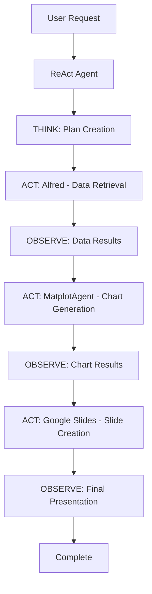

# ReAct Slides Agent 🤖

A simple ReAct (Reasoning and Acting) agent that orchestrates slide creation using existing MCP tools.

## Overview

The ReAct Slides Agent follows the **ReAct pattern**:

1. **THOUGHT**: Analyze user request and plan workflow
2. **ACTION**: Execute tool (Alfred, MatplotAgent, or Google Slides)  
3. **OBSERVATION**: Process results and decide next steps
4. **Repeat** until task complete

## Architecture



## Tools Used

| Tool | Purpose | Server URL |
|------|---------|------------|
| **Alfred** | Business data retrieval | `http://localhost:8000/mcp` |
| **MatplotAgent** | Chart generation | `http://localhost:8010/mcp` |
| **Google Slides Tools** | Slide creation & positioning | Built-in (Clean Positioning System) |

## Quick Start

### 1. Start the ReAct Agent Server

```bash
python react_slides_agent.py
```

Server runs on: `http://localhost:8020/mcp`

### 2. Test the Implementation

```bash
python test_react_agent.py
```

### 3. Use from Client

```bash
python example_react_client.py
```

Or use any MCP client:

```python
from mcp_use import MCPClient

client = MCPClient.from_dict({
    "mcpServers": {
        "react_slides_agent": {"url": "http://localhost:8020/mcp"}
    }
})

result = await client.call_tool("create_slides_with_react", {
    "user_request": "Create a business performance report",
    "merchant_token": "your_merchant_token",
    "starting_date": "2024-06-01",
    "end_date": "2024-09-01"
})
```

## Available MCP Tools

### `create_slides_with_react`

**Description**: Main slide creation tool using ReAct reasoning

**Parameters**:
- `user_request` (str): Natural language description of slides needed
- `merchant_token` (str): Scalapay merchant identifier  
- `starting_date` (str): Start date (YYYY-MM-DD)
- `end_date` (str): End date (YYYY-MM-DD)

**Returns**:
```json
{
  "success": true,
  "presentation_id": "1abc123...",
  "total_duration": 45.2,
  "plan": {
    "data_requests": ["monthly sales year over year", "AOV"],
    "chart_types_needed": ["line_chart", "bar_chart"],
    "reasoning": "Analysis of user request..."
  },
  "steps": [
    {
      "step": "data_retrieval",
      "duration": 15.3,
      "success": true,
      "data_sets": 6
    },
    {
      "step": "chart_generation", 
      "duration": 22.1,
      "success": true,
      "charts_created": 5
    },
    {
      "step": "slide_creation",
      "duration": 7.8,
      "success": true,
      "presentation_id": "1abc123..."
    }
  ]
}
```

### `get_positioning_system_status`

**Description**: Check clean positioning system health

**Returns**: System status and health information

## ReAct Agent Features

### 🧠 Intelligent Planning
- LLM-powered request analysis
- Automatic data request selection
- Chart type recommendation based on context

### 🔄 Flexible Execution  
- Dynamic workflow adaptation
- Error handling with fallback options
- Real-time progress reporting

### ⚡ Performance Optimized
- Uses Clean Positioning System (50% rollout)
- Concurrent data retrieval and chart generation
- Batch operations for slide creation

### 🛡️ Robust Error Handling
- Automatic fallback to legacy systems
- Detailed error reporting
- Graceful degradation

## Reasoning Examples

### Example 1: Business Performance Request
**User Request**: "Create a comprehensive business performance report"

**ReAct Reasoning**:
```
🤔 THOUGHT: User wants comprehensive business insights
   Need: sales trends, customer behavior, product performance
   
📊 ACTION: Request data via Alfred
   - monthly sales year over year  
   - AOV
   - monthly orders by user type
   - orders by product type
   
📈 ACTION: Generate charts via MatplotAgent
   - Line charts for trends
   - Bar charts for comparisons
   - Pie charts for distributions
   
🎨 ACTION: Create slides via Google Slides
   - Use clean positioning system
   - Template-driven layout
   - Batch chart insertion
```

### Example 2: Specific Metric Focus
**User Request**: "Show me customer demographics and payment preferences"

**ReAct Reasoning**:
```  
🤔 THOUGHT: Focus on customer analysis
   Need: demographic data, payment method insights
   
📊 ACTION: Request targeted data
   - scalapay users demographic in percentages
   - orders by product type (pay in 3, pay in 4)
   - AOV by product type
   
📈 ACTION: Generate appropriate visualizations
   - Pie charts for demographics
   - Stacked bars for payment types
   
🎨 ACTION: Create focused presentation
```

## Prerequisites

1. **MCP Servers Running**:
   - Alfred (data): Port 8000
   - MatplotAgent (charts): Port 8010

2. **Google API Setup**:
   - Service account credentials
   - Google Slides API enabled
   - Google Drive API enabled

3. **Environment Variables**:
   ```bash
   export GOOGLE_APPLICATION_CREDENTIALS="path/to/credentials.json"
   export OPENAI_API_KEY="your_openai_key"
   ```

4. **Python Dependencies**:
   ```bash
   pip install fastmcp langchain-openai mcp-use
   ```

## Configuration

The agent uses the same configuration system as the main tools:

- **Template ID**: Default Google Slides template
- **Folder ID**: Google Drive folder for outputs  
- **Clean Positioning**: Hybrid mode with 50% rollout
- **Concurrent Processing**: Enabled for performance

## Monitoring

### Logs to Watch For:
- `🤔 THINKING: Planning slide creation...`
- `📊 ACTING: Retrieving data using Alfred`
- `📈 ACTING: Creating charts using MatplotAgent`
- `🎨 ACTING: Creating slides using Google Slides tools`
- `✅ OBSERVATION: [Step] completed successfully`

### Performance Metrics:
- Planning time: ~2-5 seconds
- Data retrieval: ~10-20 seconds  
- Chart generation: ~15-30 seconds
- Slide creation: ~5-15 seconds
- **Total**: ~30-70 seconds for complete workflow

## Troubleshooting

### Common Issues:

1. **"Connection refused"**: Make sure prerequisite MCP servers are running
2. **"GoogleApiSupport configuration issue"**: Check credentials and API setup
3. **"Planning failed"**: Check OpenAI API key and network connection
4. **"Clean positioning not available"**: Falls back to legacy automatically

### Debug Mode:
Set environment variable for detailed logging:
```bash
export SCALAPAY_DEBUG_MODE=true
```

## Architecture Notes

This ReAct agent demonstrates:
- **Separation of Concerns**: Each tool has a specific responsibility
- **Composability**: Tools can be orchestrated in different workflows
- **Observability**: Detailed logging and metrics at each step
- **Resilience**: Automatic fallback mechanisms
- **Performance**: Leverages existing optimizations (concurrency, clean positioning)

The agent serves as a higher-level orchestrator while preserving all the power and flexibility of the underlying specialized tools.